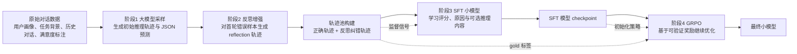
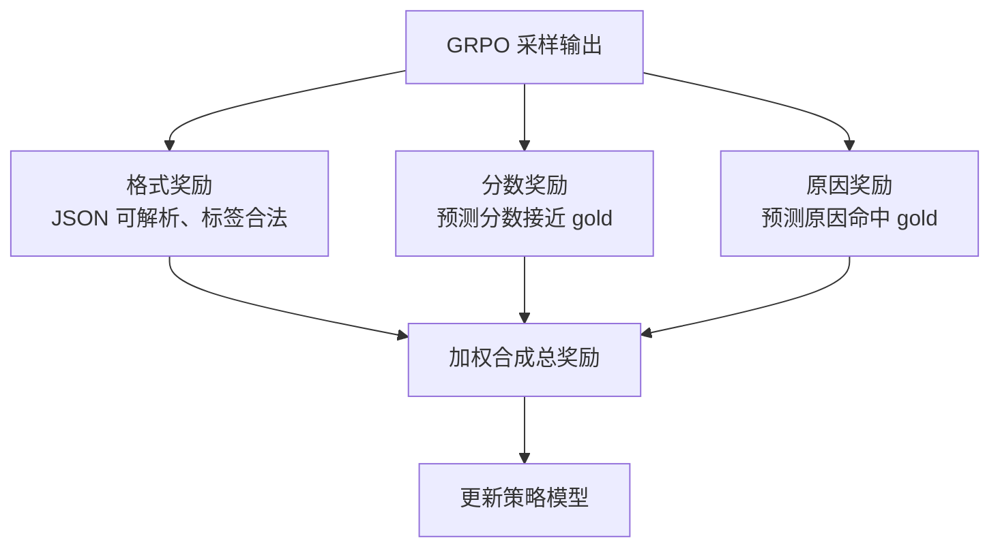

# Satisfaction 多阶段训练流程图

## 汇报版精简图

## 奖励设计

## 对应脚本

- `detection/collect_api_model_traces.py`：大模型采样与反思轨迹生成
- `detection/sft_from_traces.py`：基于轨迹做监督微调
- `detection/grpo_from_sft.py`：基于 SFT checkpoint 做 GRPO
- `detection/eval_sft_from_traces.py`：统一评测 SFT / GRPO 后模型

