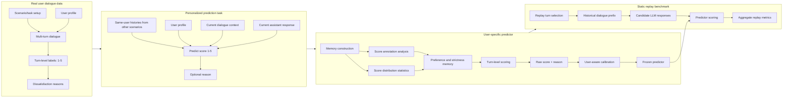

# ARR Framework Figure Design

## Goal

This document specifies a draw.io-ready framework figure for the ARR paper
outline in `detection/reports/overview/arr_paper_outline_and_latex.md`.

The figure should communicate four connected components:

1. real user dialogue data collection
2. personalized turn-level satisfaction prediction task construction
3. memory-based predictor design with user-aware calibration
4. static replay evaluation for personalized dialogue model benchmarking

## Recommended Main Figure Layout

Use a left-to-right four-column pipeline with a thin feedback/evaluation band at
the bottom.

### Column 1: Real User Dialogue Data Collection

Title: `Real user dialogue data`

Elements:

- scenario/task setup
- user profile collection
- multi-turn user-assistant dialogue
- post-dialogue turn-level satisfaction annotation
- dissatisfaction reason annotation for low-score turns

Output artifact:

- `Labeled user histories`

Visual notes:

- Use small stacked dialogue cards to show multiple turns.
- Attach `1-5` score badges to assistant turns.
- Use a note icon for dissatisfaction reasons.

### Column 2: Personalized Prediction Task

Title: `Personalized satisfaction prediction`

Inputs:

- same user's labeled histories from other scenarios
- user profile
- current dialogue context
- current assistant response

Output:

- predicted turn satisfaction score `1-5`
- optional dissatisfaction reason

Visual notes:

- Show cross-task personalization by drawing history cards from other scenario
  boxes into the prediction example.
- Use a clear `score <= 3` / `score >= 4` boundary marker.

### Column 3: Predictor Agent

Title: `User-specific predictor`

Submodules:

- memory construction
  - score annotation analysis
  - score distribution statistics
  - preference and strictness summary
  - positive/negative evidence
- turn-level scoring
  - semantic response evaluation
  - raw `1-5` score prediction
  - reason prediction
- post-hoc user-aware calibration
  - mean shift
  - CDF/rank mapping
  - boundary correction or reporting

Visual notes:

- Use a central memory cylinder or notebook-like block.
- Put calibration after raw scoring, not before scoring.
- Mark the predictor as frozen before it enters static replay.

### Column 4: Static Replay Evaluation

Title: `Static replay benchmark`

Flow:

1. select replay turns from historical dialogues
2. give each candidate LLM only the historical dialogue prefix
3. collect generated assistant response
4. score response with frozen personalized predictor
5. aggregate model-level metrics

Outputs:

- predicted user-specific satisfaction
- SAT/DSAT rate
- user-macro, task-macro, user-task macro means
- confidence intervals

Visual notes:

- Represent candidate LLMs as parallel model boxes.
- Make the frozen predictor visually shared across all candidate models.
- Use a final leaderboard/table icon for aggregate metrics.

## Figure Narrative

The figure should make one argument:

Human-labeled personalized satisfaction histories are first collected from real
users, then reformulated into a cross-task turn-level prediction task. A
predictor builds user memory from source-task histories, predicts satisfaction
for a target turn, and calibrates scores to the user's historical scoring style.
The same frozen predictor can then score candidate LLM responses in a static
replay benchmark.

## Suggested Visual Style

- Use four light background lanes, one for each component.
- Keep arrows left-to-right.
- Use one accent color per component:
  - data: blue
  - task: teal
  - predictor: orange
  - replay/evaluation: purple
- Use grayscale text and thin arrows to keep the figure paper-friendly.
- Use small icons only as anchors; do not make icons the main content.
- Avoid gradients and heavy shadows for ARR/ACL-style print clarity.

## Suggested Icons

Use one consistent open-source line icon set, such as Lucide, Tabler, or
Heroicons.

Icon concepts:

- users/profile: `users`, `user-round`, `id-card`
- scenario/task: `clipboard-list`, `target`, `map`
- dialogue: `messages-square`, `message-circle`
- rating: `star`, `badge-check`
- reason/note: `file-text`, `sticky-note`
- memory: `database`, `brain`, `notebook-tabs`
- statistics: `bar-chart-3`, `chart-no-axes-combined`
- calibration: `sliders-horizontal`, `gauge`
- model: `cpu`, `bot`
- replay: `history`, `repeat`
- aggregation: `table`, `trophy`, `chart-column`

## AI-Assisted Drafting Prompt

Use this prompt to generate a first version in Mermaid or draw.io XML, then
manually polish it in draw.io:

```text
Create a clean academic framework figure for an ARR/ACL-style paper. Use a
left-to-right four-column pipeline with light background lanes.

Column 1: Real user dialogue data collection. Include scenario/task setup, user
profile collection, multi-turn user-assistant dialogue, post-dialogue turn-level
satisfaction labels from 1 to 5, and dissatisfaction reasons for low-score
turns. Output: labeled user histories.

Column 2: Personalized turn-level satisfaction prediction task. Inputs are
same-user labeled histories from other scenarios, user profile, current dialogue
context, and current assistant response. Output is predicted satisfaction score
1-5 and optional dissatisfaction reason. Highlight the satisfaction boundary:
scores <=3 dissatisfied, scores >=4 satisfied.

Column 3: User-specific predictor agent. Show memory construction from history
labels and reasons, including score annotation analysis, score distribution
statistics, preference/strictness summary, and positive/negative evidence. Then
show turn-level scoring that produces a raw 1-5 score and reason prediction.
Then show post-hoc user-aware calibration using mean shift and CDF/rank mapping.
Mark the predictor as frozen for replay.

Column 4: Static replay evaluation. Show replay turn selection, candidate LLMs
generating responses from historical dialogue prefixes, frozen personalized
predictor scoring each response, and final aggregation into model-level
personalized satisfaction metrics such as mean score, SAT/DSAT rate, user macro,
task macro, and confidence intervals.

Use simple rectangular modules, thin arrows, compact labels, and small line
icons. Make it suitable for a two-column NLP paper figure.
```

## GPT-Image Prompt

Use this prompt when generating a directly usable paper-style framework figure
with GPT-image. It is intentionally visual and layout-specific, because generic
diagram prompts often collapse into plain text lists.

```text
Create a polished academic framework diagram for an NLP/ARR paper, suitable for
inclusion as the main system figure in a two-column paper. The diagram should
look like a clean vector infographic, not a poster and not a plain text flowchart.

Canvas and style:
- Wide horizontal layout, 16:9 aspect ratio.
- White background.
- Four large vertical lanes arranged left to right, each with a very light
  tinted background and a concise lane title.
- Use thin dark-gray arrows connecting modules left to right.
- Use simple line icons, small score badges, compact rectangular modules, and
  minimal text.
- Use a clean sans-serif academic style.
- Keep all text sharp, readable, and correctly spelled.
- Avoid gradients, heavy shadows, decorative blobs, 3D effects, and crowded text.

Overall title at the top:
"Personalized Satisfaction Prediction and Static Replay Evaluation"

Lane 1 title:
"1. Real User Dialogue Data"
Visual content:
- A small task card labeled "Scenario / Task".
- A user profile card labeled "User Profile".
- A stack of user-assistant chat bubbles labeled "Multi-turn Dialogue".
- Small score badges attached to assistant turns: "1", "3", "5".
- A note icon labeled "Reason" next to a low-score turn.
- Output tag at the bottom: "Labeled User Histories".

Lane 2 title:
"2. Prediction Task"
Visual content:
- Four input cards feeding into a central prediction box:
  "History from Other Tasks", "User Profile", "Current Context",
  "Assistant Response".
- Central box label: "Predict Turn Satisfaction".
- Output badges: "Score 1-5" and "Reason if <=3".
- Include a small boundary marker: "<=3 DSAT | >=4 SAT".

Lane 3 title:
"3. User-Specific Predictor"
Visual content:
- Three connected modules inside the lane:
  "Memory Construction" -> "Turn-Level Scoring" -> "User-Aware Calibration".
- Under "Memory Construction", show tiny sublabels:
  "Score Stats", "Preference Memory", "Strictness".
- Under "Turn-Level Scoring", show output:
  "Raw Score + Reason".
- Under "User-Aware Calibration", show tiny sublabels:
  "Mean Shift", "CDF Mapping".
- Add a small lock or snowflake icon near the final predictor output labeled
  "Frozen Predictor".

Lane 4 title:
"4. Static Replay Benchmark"
Visual content:
- Flow inside the lane:
  "Replay Turn Selection" -> "Dialogue Prefix" -> "Candidate LLMs" ->
  "Predictor Scoring" -> "Aggregate Metrics".
- Show three small parallel model boxes under "Candidate LLMs":
  "LLM A", "LLM B", "LLM C".
- Draw an arrow from the frozen predictor in Lane 3 into "Predictor Scoring".
- Final metrics card with compact labels:
  "Mean Score", "SAT/DSAT Rate", "User Macro", "CI".

Composition requirements:
- The four lanes should be visually balanced and aligned.
- Each module should be an actual box or symbol, not just text on the canvas.
- Use icons to reinforce meaning: user/profile, chat, star/rating, note,
  database/memory, sliders/calibration, bot/model, table/metrics.
- Use consistent colors:
  Lane 1 light blue, Lane 2 light teal, Lane 3 light orange, Lane 4 light purple.
- Keep the figure readable at paper scale; prefer short labels over long
  sentences.

Do not include:
- paragraphs of explanatory text
- decorative illustrations unrelated to the method
- people photos
- screenshots
- code
- equations
- tiny unreadable labels
```

If GPT-image still produces garbled text, generate the same figure with blank
boxes and icons first, then add the final labels manually in draw.io.

## Mermaid Skeleton

This is only for layout planning. The final figure should be polished in
draw.io.


